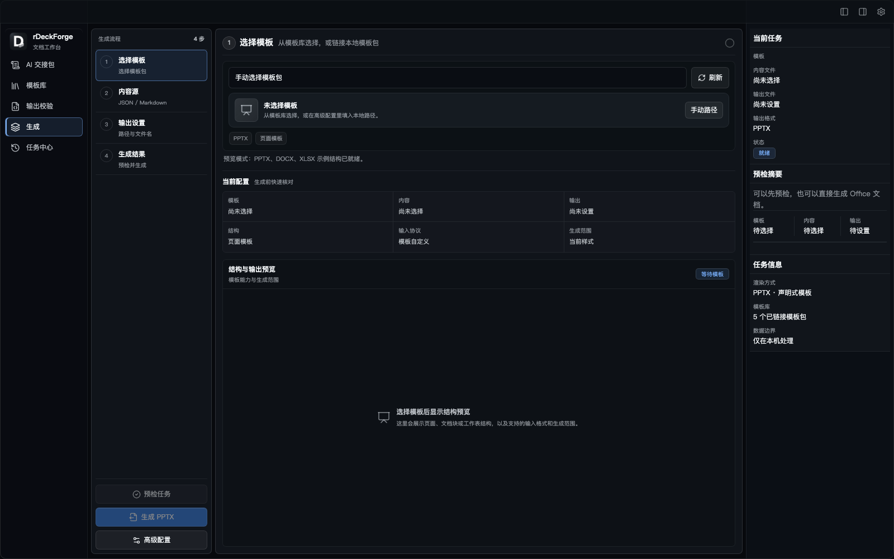

# rDeckForge 界面与公开演示说明

rDeckForge 是本地文档工作台，负责模板协议、AI 交接、内容验收和 Office 渲染。公开界面素材只展示应用布局和仓库内置示例，不链接真实模板、客户资料或业务文件。

## 生成工作区

生成页把工作流拆成四步：选择模板、选择内容、设置输出、查看结果。右侧检查器同步显示当前任务、预检摘要、模板库数量和本机处理边界。

截图采用未绑定文件的安全初始状态；仓库中的 `examples/` 目录提供 `demo-medical-teaching-v1` 等合成模板和内容，仅用于本地演示，不包含真实医院、公司或客户资料。

## 推荐演示流程

1. 从 `examples/templates/` 选择合成模板包。
2. 使用 `examples/content/` 中的示例 JSON 或 Markdown。
3. 先运行输出校验和预检，确认缺失绑定、协议错误和输出路径提示。
4. 将输出写入 `target/` 或其他临时目录，并在发布前清理产物。

真实模板、Logo、客户资料、内部 prompt、API key 和导出文件必须留在本机私有目录。应用只保存必要的路径、校验摘要和任务记录。

## 公开截图规则

- 只使用仓库内置 examples、合成内容和空状态。
- 不把用户的 PPTX、DOCX、XLSX、Logo、客户 brief 或本地绝对路径放入截图。
- 截图来自本地 web 预览，不代表 Office 已生成成功，也不是 Playwright 或冒烟测试结果。

相关入口：[README](../README.md)、[公开仓库边界](../PUBLIC_REPOSITORY.md)、[安全报告](../SECURITY.md)、[发布说明](../RELEASE.md)。
